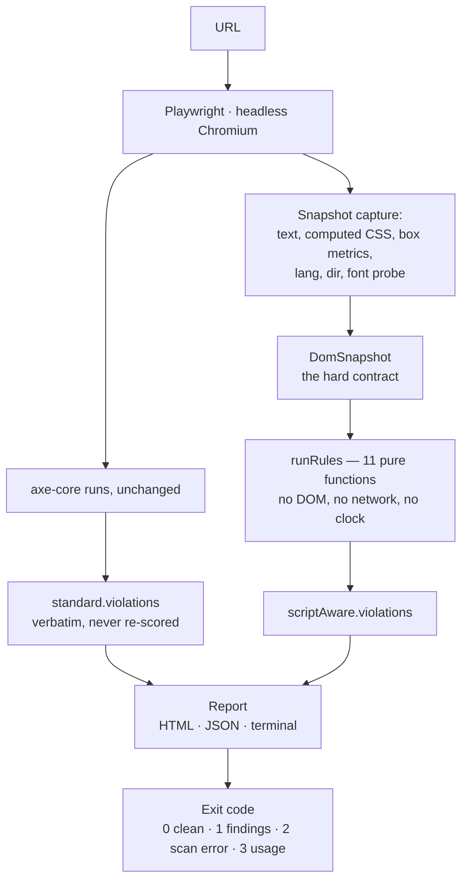

# GlyphLint

**Accessibility checks that only appear when your text isn't English.** GlyphLint is a command-line
scanner for the accessibility defects caused by *writing systems* rather than by markup — cursive
letters pulled apart by letter spacing, tone marks clipped by a box sized for Latin, direction never
declared. It runs [axe-core](https://github.com/dequelabs/axe-core) for standard WCAG coverage, then
adds its own script-aware layer on top, and reports the two separately so you can always tell which
tool found what.

For developers, designers and accessibility auditors working on pages that are read in Arabic,
Hebrew, Thai, Devanagari, Vietnamese, Chinese, Japanese or Korean.

---

> **A demo GIF belongs here, and is not here yet.**
> A recording of a scan will be added before this repository is announced. Nothing is embedded now
> because nothing has been recorded yet, and a placeholder image pretending to be a demo would be
> the first dishonest thing in a project whose whole argument is that it does not do that.

**Live report:** the campaign report is published to
`https://haeithm-muter.github.io/glyphlint/` by [`.github/workflows/deploy.yml`](.github/workflows/deploy.yml)
from the results committed in [`results/`](results/). **That link is not live until the workflow has
run for the first time**, and this line will say so until it is.

---

## The problem

A designer opens the Arabic translation of a page built for English, keeps the letter spacing that
made the Latin headline breathe, and ships it:

```css
.headline {
  letter-spacing: 2px; /* fine for Latin. Not fine for Arabic. */
}
```

Arabic is cursive. Its letters change shape by position and join into a continuous line, and that
joining is part of how a word is read. Positive tracking severs the joins at exactly the points
where letters should connect, so a word arrives as a row of disconnected shapes. The reader does not
see loose text; they see text that has come apart.

```
مرحبا بالعالم                ← what the page should show
م ر ح ب ا  ب ا ل ع ا ل م      ← roughly what 2px of tracking does to it
```

> **A screenshot of a real page doing this belongs here.** It is the single strongest argument this
> project has, and it will be added from a real scan before announcement rather than mocked up.

Nothing in that markup is wrong. The HTML is valid, the contrast is fine, the ARIA is correct, the
alt text is present. Every mainstream accessibility checker passes the page, because none of them
holds a table of what each writing system needs from typography. GlyphLint reports it as:

```
critical  cursive-script-letter-spacing  (1 element)
          Letter spacing applied to a cursive script
          #arabic-tracked
            letter-spacing is set to 2px on Arabic text.
```

And it is not one defect. Thai tone marks stack above the line and get clipped by containers sized
against Latin. Thai and Lao are written without spaces between words, so `word-break: break-all`
breaks inside a syllable. Hebrew and Arabic need a declared direction, not a CSS one. Vietnamese
stacks two diacritics on a single vowel. Han, Kana and Hangul have no case at all, so
`text-transform: uppercase` is a no-op that quietly tells you the stylesheet was never read by
anyone who reads the language.

## Why the existing tools are not enough

**They are excellent, and this project is built on one of them.**

- **[axe-core](https://github.com/dequelabs/axe-core)** by Deque Systems is the engine behind most
  accessibility tooling in the industry, including the accessibility panel in Chrome DevTools. It is
  rigorous, well maintained, conservative about false positives, and it is what GlyphLint runs
  first, unchanged, on every scan.
- **[Lighthouse](https://developer.chrome.com/docs/lighthouse/)** puts axe's checks in front of
  every web developer with a keyboard shortcut, which is worth more than any single rule.
- **[WAVE](https://wave.webaim.org/)** by WebAIM has taught more people to see accessibility
  problems than any other tool, by showing them on the page itself.

None of them is missing anything it set out to check. They are **deliberately language-neutral**:
they check structure, semantics and contrast, and those questions have the same answer in every
language. Checking typography *per writing system* requires something none of them was built to
carry — a table of what each script needs, and the willingness to say that a stylesheet which is
correct for Latin is wrong for Arabic.

That table is this project. GlyphLint is **additional to** these tools, never a replacement, and its
report keeps axe's findings in axe's own words in a separate section for exactly that reason.

## How it works



The snapshot is the seam that makes the rules trustworthy. A rule never touches a browser: it reads
captured data and returns findings, so it runs in milliseconds, can be argued with in a test, and
gives the same answer twice. When a rule needs something it cannot see, the fix is to capture that
value and bump the snapshot version — never to let the rule reach for a page.

## The rules

Eleven script-aware rules. This table is printed by `glyphlint rules`, so it can be checked against
the code rather than trusted.

| Rule | Severity | Confidence | Writing systems |
|---|---|---|---|
| `cursive-script-letter-spacing` | critical | high | arabic, mongolian, nko, syriac |
| `missing-script-font-coverage` | serious | heuristic | every modelled script except latin |
| `missing-dir-attribute` | serious | medium | arabic, hebrew, nko, syriac, thaana |
| `lang-script-mismatch` | serious | medium | all sixteen modelled scripts |
| `insufficient-line-height-for-script` | moderate | heuristic | all modelled scripts except mongolian |
| `physical-css-in-bidi-context` | moderate | medium | arabic, hebrew, nko, syriac, thaana |
| `unisolated-bidi-run` | moderate | heuristic | arabic, hebrew, nko, syriac, thaana |
| `unsafe-word-break-for-script` | moderate | medium | arabic, han, kana, khmer, lao, mongolian, nko, syriac, thai |
| `clipped-stacked-marks` | moderate | heuristic | arabic, devanagari, hebrew, khmer, lao, mongolian, nko, syriac, thaana, thai |
| `case-transform-on-caseless-script` | minor | high | every caseless script |
| `unmirrored-directional-icon` | minor | heuristic | arabic, hebrew, nko, syriac, thaana |

**Confidence is not decoration.** `high` means the condition is decidable from what was captured.
`medium` means the condition is clear but the judgement around it can be wrong on an unusual page.
`heuristic` means the rule is inferring from evidence that can be wrong — every such finding is
badged in the report, and every rule carries a `limitations` sentence saying what it cannot see,
shown next to its findings rather than buried in a footnote.

## Results

Every number in this section is generated by `npm run metrics` from the campaign results committed
in [`results/`](results/). Nothing between the markers is written by hand, and a figure this project
cannot reproduce from a results file does not appear anywhere in this README.

<!-- METRICS:START -->
_Generated by `npm run metrics` from `results/campaign-2026-08-11.json`.
Do not edit by hand._

**10 targets attempted** out of 30 on the list · **8 answered** · **7 served a page in the writing system they were listed for**.

| Outcome | Sites |
|---|---|
| Scanned | 8 |
| Disallowed by robots.txt | 0 |
| Skipped, permission could not be established | 1 |
| Failed (timeout or error) | 1 |

1 of the 8 sites that answered did not serve their homepage to a scanner that identifies itself honestly. They are counted as scanned and excluded from the measured figure above: https://www.isna.ir.

### The two layers, side by side

| | Rules that reported | Elements reported | Sites with findings |
|---|---|---|---|
| Standard rules (axe-core) | 21 | 1142 | 8 |
| Script-aware rules (GlyphLint) | 11 | 2336 | 7 |

**These two numbers are not comparable and are not compared here.** axe-core counts elements failing its own rules; GlyphLint counts text nodes failing ours. A page with one styled container holding forty paragraphs is one element to axe and forty text nodes to us. The columns are printed side by side because the specification asks for both, not because one divided by the other means anything.

### What GlyphLint found, ranked

Percentages are out of the 8 sites that were scanned — not out of the 10 attempted, and not out of the web.

| Rule | Sites | Of the sites scanned | Elements | Severity | Confidence |
|---|---|---|---|---|---|
| `physical-css-in-bidi-context` | 7 | 87.5% | 864 | moderate | medium |
| `insufficient-line-height-for-script` | 7 | 87.5% | 579 | moderate | heuristic |
| `unisolated-bidi-run` | 6 | 75% | 43 | moderate | heuristic |
| `clipped-stacked-marks` | 4 | 50% | 67 | moderate | heuristic |
| `missing-dir-attribute` | 3 | 37.5% | 433 | serious | medium |
| `missing-script-font-coverage` | 3 | 37.5% | 97 | serious | heuristic |
| `case-transform-on-caseless-script` | 3 | 37.5% | 53 | minor | high |
| `unmirrored-directional-icon` | 3 | 37.5% | 16 | minor | heuristic |
| `lang-script-mismatch` | 2 | 25% | 165 | serious | medium |
| `unsafe-word-break-for-script` | 1 | 12.5% | 18 | moderate | medium |
| `cursive-script-letter-spacing` | 1 | 12.5% | 1 | critical | high |

axe-core reported 1142 elements across 21 of its own rules on the same pages, and passed 292 checks. Those findings are axe's work, not ours.

### What these numbers do not say

**The rule this project was built around barely fired.** cursive-script-letter-spacing — letter spacing severing the joins in a cursive script — found 1 element on 1 site. The major publishers scanned here do not put letter spacing on their cursive text. That is a real result and it is published as it stands: the defect is rare on professionally built sites, which is not the same as harmless where it does happen.

**Most of the volume comes from rules that do not claim certainty.** The two largest, physical-css-in-bidi-context (medium) and insufficient-line-height-for-script (heuristic), account for 1443 of 2336 elements — 61.8% of everything GlyphLint reported. Only 54 element(s) came from rules marked high confidence. A large total is not a large number of confirmed defects, and this one should not be read as one.

**The two layers are counted in different units, so the comparison is not a score.** axe-core counts elements failing its rules. GlyphLint counts text nodes failing ours. Whichever number is larger, dividing one by the other produces nothing, and this project does not publish that division.

<!-- METRICS:END -->

### What was checked by hand, and what was not

Unlike the block above, this section is written by hand. It records a manual verification carried
out on 11 August 2026: six findings from the committed results were opened in a browser's developer
tools on the live pages and checked one by one. **Five were correct. One was wrong.**

| Finding | Site | Verdict |
|---|---|---|
| `cursive-script-letter-spacing` on `#text-blink` | jang.com.pk | **Correct.** `letter-spacing: 1px` on Urdu text set in Nafees at 18px, visible on the page. It is also the only element on that page carrying author letter spacing on Arabic-script text, which matches the single finding reported. |
| `lang-script-mismatch` | express.pk | **Correct.** `<html lang="en">` with 176 elements of substantial Urdu text under it and no closer `lang`. A screen reader following that attribute reads Urdu with an English voice. |
| `missing-dir-attribute` | express.pk | **Correct.** No `dir` attribute anywhere on the page; the right-to-left layout comes from CSS alone, which is exactly the weaker case the rule grades `moderate`. |
| `case-transform-on-caseless-script` | aljazeera.net | **Correct.** `text-transform: uppercase` applied to Arabic headings and controls. Arabic has no case, so the declaration is a Latin assumption that survived translation. |
| `physical-css-in-bidi-context` | aljazeera.net | **Correct.** Arabic text in a right-to-left context with `text-align: left`, and separately with `text-align: right`. Both are as reported. |
| `clipped-stacked-marks` on `#bypass-block-links-label` | aljazeera.net | **Wrong — a false positive.** The element is a skip link deliberately hidden from sighted readers with the standard pattern: 1×1 pixel, `position: absolute`, `clip: rect(1px, 1px, 1px, 1px)`, `clip-path: inset(100%)`. Nothing is being taken away from anybody; the text is fully available to a screen reader. **Fixed since — see below.** |

**The false positive was not isolated.** In the campaign that verification was run against, 16 of
the 81 `clipped-stacked-marks` findings reported a container one pixel tall — the signature of that
visually-hidden pattern — and every one of the 16 was on the page examined above. The rule warned
that it could not tell deliberate truncation from accidental clipping; it did not warn that it
counted text hidden on purpose for assistive technology.

### The rule was fixed, the campaign was re-run, and here is what moved

The fix is decision 025: a node is skipped when it carries `clip: rect(1px, 1px, 1px, 1px)` or
`clip-path: inset(100%)` **and** its box is at most two pixels across in both directions. Both
halves are required, so a genuinely clipped box that happens to carry a clip is still reported. The
same ten targets were then scanned again, and the results file in this repository is the **second**
run. Decision 026 explains why the earlier file was replaced rather than kept beside it.

**On the page where the defect was found, the fix is exactly measurable.** aljazeera.net was scanned
in both runs:

| | Before the fix | After the fix |
|---|---|---|
| GlyphLint findings on that page | 49 | 33 |
| of which `clipped-stacked-marks` | 16 | 0 |

Sixteen findings disappeared and nothing else on that page changed. Every one of the sixteen was the
visually-hidden idiom; the page had no genuine clipping for the rule to report.

**The campaign totals from the two runs are not comparable, and should not be read as a before and
after.** Two sites that had timed out in the first run answered in the second, and one that had
answered failed. The set of pages behind the numbers is different, so the totals moved for reasons
that have nothing to do with the fix. Only the per-page comparison above isolates it.

**The scope of this check is narrower than it looks, and the reason is worth stating.** All six
findings are in **one writing system, the Arabic script** — Arabic on aljazeera.net, Urdu on
jang.com.pk and express.pk. This campaign ran the first 10 targets of the list, which are 6 Arabic
and 4 Persian/Urdu sites, so no Thai, Hebrew, Devanagari or CJK page was scanned and **none was
verified**. The maintainer reads Arabic and does not read Thai or Hindi, which is precisely the bias
that would otherwise produce a confident claim about scripts nobody checked.

**So: manual verification covers the Arabic script only.** Every rule that fires on Thai, Hebrew,
Devanagari, Vietnamese or CJK text is, at this point, tested against local fixtures and unverified
in the wild.

### Where the thresholds come from

Every rule compares a page against numbers. All of them are listed here, sourced or labelled an
estimate, because a threshold with no stated source is the most dangerous thing in a linter.

| Threshold | Value | Source |
|---|---|---|
| Line height, thirteen writing systems | 1.5 × font size | **WCAG 2.1.** Two criteria name 1.5: SC 1.4.12 Text Spacing, for spacing the reader applies, and SC 1.4.8 Visual Presentation (AAA), which requires at least space-and-a-half within paragraphs from the author. The property table records the first; a finding cites the second, and only when the measured value falls below it. |
| Line height, Thai / Lao / Khmer | 1.6 × font size | **Estimate.** Ours. No standards document states it. |
| Letter-spacing noise floor | 0.01 px | **Estimate.** Below this, a computed value is rounding left over from relative units rather than a decision anyone made. |
| Minimum text for a letter-spacing finding | 2 graphemes | **Estimate.** A join needs two letters. |
| Single-line box, excluded from line-height findings | client height < 2 × font size | **Estimate.** A box shorter than two lines holds one line, which cannot collide with anything. |
| Minimum text for a font-coverage finding | 4 graphemes | **Estimate.** Two glyphs can measure identically in two fonts by coincidence; a short word rarely does. |
| Maximum Latin share for a case-transform finding | 20% of lettered graphemes | **Estimate.** Above it, `text-transform` has real Latin text to act on. |
| Minimum right-to-left text before a missing `dir` is reported | 15 graphemes | **Estimate.** Below it the text is a brand name or a loanword, which the bidirectional algorithm places correctly on its own. |
| Minimum text before a language/script mismatch is reported | 20 graphemes, 80% in one script | **Estimate.** A heading or a quoted phrase in another language is not a mismatch. |
| Minimum embedded run before a bidi isolation finding | 2 graphemes | **Estimate.** A single character is an initial or a footnote marker. |
| Minimum text before an unsafe line-break finding | 2 graphemes | **Estimate.** A break needs a word to break. |
| Overflow tolerated before text counts as clipped | 1 px | **Estimate.** Sub-pixel layout reported as rounded integers can differ by a pixel on a box clipping nothing. |
| Delay between sites in a campaign | 2000 ms minimum | **Policy, not measurement.** A floor this tool will not go below for any host that is not loopback. |

Three things this table is honest about:

- **The 1.6 has nothing behind it.** Every finding that rests on it says so in its own text, and the
  rule that uses it is marked `heuristic`.
- **The line-height table is not yet per-script.** It is one sourced number applied to thirteen
  writing systems, plus one estimate applied to three. Deriving real per-script values from the W3C
  layout requirement documents — ALREQ, HLREQ, JLREQ, CLREQ — is work that has not been done, and
  the property table currently cites none of them.
- **The flags and the thresholds disagree in one place.** Ten writing systems are marked as having
  stacked marks; only three of them carry the raised ratio. Arabic and Devanagari are measured by the
  same leading as Latin despite placing ink outside the Latin em box.

## Install and use

```powershell
npm install
```

```powershell
npx playwright install chromium
```

The browser is a separate step on purpose: `npm install` skips the download, and nothing that loads
a page works until this has run once.

```powershell
npx glyphlint scan https://example.com
```

```powershell
npx glyphlint scan https://example.com --format html --out report.html
```

```powershell
npx glyphlint rules
```

```powershell
npx glyphlint campaign --input sites/targets.json --out results
```

| Option | What it does |
|---|---|
| `--format terminal\|json\|html` | Output format. Default: terminal. |
| `--out <path>` | Write the report to a file instead of stdout. |
| `--rules <ids>` / `--disable <ids>` | Narrow by rule id. Matched against axe's rule ids as well as ours. |
| `--scripts <ids>` | Report only these writing systems. GlyphLint findings only — an axe finding carries no writing system to filter on. |
| `--min-severity <level>` | `critical`, `serious`, `moderate` or `minor`. Reads axe's own impact value without re-scoring it. |
| `--timeout <ms>` | Hard limit on page load. Default 20000. |
| `--no-screenshot` | Do not save a screenshot. One is saved by default. |

Whatever a filter withholds is counted and printed, so a narrowed report never reads as a cleaner
page. **Exit codes:** `0` no violations · `1` violations found · `2` the page could not be scanned ·
`3` invalid usage. CI depends on that contract.

### In GitHub Actions

```yaml
- uses: haeithm-muter/glyphlint@v0
  with:
    url: https://example.com
    min-severity: serious
```

## What this project does not do

- **Fix your code.** It reports; it does not edit.
- **Scan pages behind authentication.**
- **Simulate a screen reader.** It reports what a screen reader is likely to be given, not what one
  would say.
- **Evaluate pages with an LLM.** Every rule is a deterministic function of captured data.
- **Scan PDFs.**
- **Crawl.** One URL, one page. A campaign is a list of homepages, visited once each.
- **Re-implement anything axe-core already does.** Contrast, ARIA, heading order and alt text are
  axe's, and they are reported as axe's.
- **Support every writing system.** Sixteen are modelled. Roughly 26,000 Unicode letters fall
  outside them — Bengali, Tamil, Telugu, Amharic, Georgian, Armenian, Sinhala, Burmese, Tibetan and
  more. When a scan meets text it cannot analyse it **says so** instead of reporting a clean page.

## Architecture decisions

The reasoning behind the non-obvious choices lives in [DECISIONS.md](DECISIONS.md), newest first.
The ones worth reading before changing anything:

| Decision | Why it matters |
|---|---|
| 003 — Vietnamese is a profile on Latin, not a script | Vietnamese has no script of its own. Inventing a `ScriptId` for it would be a language masquerading as a writing system. |
| 005 — the font probe reports suspicion, not fact | The measurement cannot tell a failed font stack from one that resolved to the platform default, so the field is named `fallbackSuspected`. |
| 010 — the flagship rule carries no WCAG reference | No success criterion covers author-applied letter spacing on a cursive script. The field is left empty rather than filled with the nearest available number. |
| 013 — physical margins cannot be told from the logical properties that fix them | In a right-to-left context `margin-inline-start` computes identically to `margin-right`, so the rule reports `text-align` only and says so. |
| 017 — the rule layer shipped unwired, and the wire came first | An empty findings section beside a populated axe section is the exact shape this project accuses other tools of producing. |
| 018 — filters narrow both layers, and everything withheld is counted | Narrowing is not editing. Every axe entry shown is the object axe produced. |
| 019 — the report is one file, with no JavaScript and no requests | And it is scanned by GlyphLint itself in the test suite, in both text directions. |
| 021 — the scanner identifies itself and does not dress up as a browser | A real browser User-Agent would get past more bot detection and would make this tool a liar. |
| 023 — one host per target, and a homepage that really is one | Three section pages of one publisher are one finding counted three times. |

## Disclaimer

GlyphLint runs an automated scan. **It reports problems that are not real, and it misses problems
that are.** Findings marked `heuristic` are inferences from evidence that can be wrong, and every
rule states what it cannot see. Nothing this tool produces is a legal assessment, a compliance
certificate, or an accusation against the people who built a page — the campaign results in this
repository are published to show what the tool detects, not to grade anybody. Verify a finding
against the page before acting on it.

## Contributing a writing system

**This is the contribution this project wants most.** Sixteen writing systems are modelled and the
rest of Unicode is not; if you read a language GlyphLint gets wrong or ignores, you know something
the code needs. The path:

1. **Add the detection pattern** in [`src/scripts/detect.ts`](src/scripts/detect.ts). Detection uses
   Unicode `Script_Extensions` property escapes, so this is usually one line and it is correct by
   definition rather than by our judgement.
2. **Add the property row** in [`src/scripts/properties.ts`](src/scripts/properties.ts): is the
   script cursive, right-to-left, caseless, written without spaces between words, does it stack
   marks, what leading does it need. **This is the real work**, because it requires knowing the
   typography rather than the code points — and every threshold you add needs a `source`, which may
   honestly be `"estimate"`.
3. **Add language mappings** in [`src/scripts/lang-map.ts`](src/scripts/lang-map.ts), so that a
   `lang` attribute in that language is not reported as a mismatch with its own script.
4. **Add at least three real samples** to the `SAMPLES` table in
   [`tests/scripts/detect.test.ts`](tests/scripts/detect.test.ts). The table is typed so that a
   script with no samples **fails to compile** — a script-aware linter cannot be tested without real
   text in the script.
5. **Write the decision down** in [DECISIONS.md](DECISIONS.md) if you made a judgement call. A
   threshold with no stated reasoning is a bug waiting to be argued about.

See [CONTRIBUTING.md](CONTRIBUTING.md) for the full workflow, and open a
[writing system issue](.github/ISSUE_TEMPLATE/add-writing-system.md) if you would rather describe
the problem than write the code. A report that says "my language breaks like *this*, here is a page
that shows it" is genuinely useful on its own.

## Licence

[MIT](LICENSE). axe-core is a separate project under the Mozilla Public License 2.0, and its
findings in any GlyphLint report are its work, not ours.
